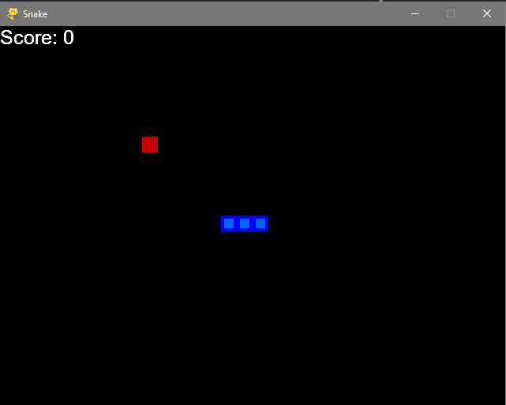

# Snake Ai

## Table of Contents

- [About](#about)
- [Getting Started](#getting_started)
- [Usage](#usage)

## About <a name = "about"></a>

Reinforcement learning is a machine learning training method based on rewarding desired behaviors and/or punishing undesired ones.

This project has been done following the tutorials on youtube from @Python_Engineer.

## Getting Started <a name = "getting_started"></a>

<div align="center">
     
</div>

These instructions will get you a copy of the project up and running on your local machine for development and testing purposes. See [deployment](#deployment) for notes on how to deploy the project on a live system.

### Prerequisites

What things you need to install the software and how to install them.

```
pip install requirements.txt

python snake_game.py
```


## Usage <a name = "usage"></a>

Add notes about how to use the system.
