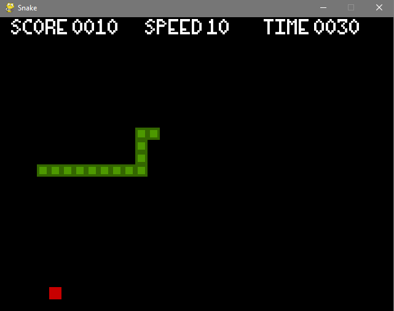
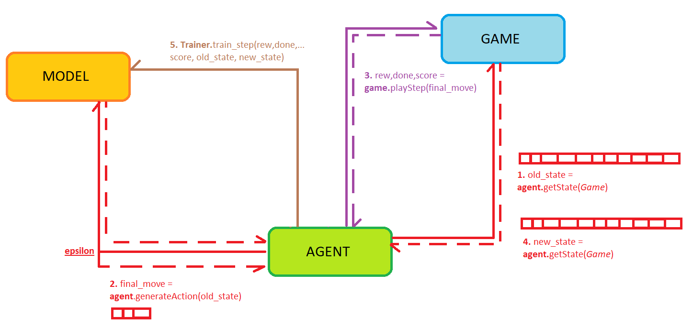

# Snake Ai

## Table of Contents

- [About](#about)
- [Getting Started](#getting_started)

## About <a name = "about"></a>

Reinforcement learning is a machine learning training method based on rewarding desired behaviors and/or punishing undesired ones.

This project has been done following the tutorials on youtube from @Python_Engineer.

## Getting Started <a name = "getting_started"></a>

<div align="center">
     
</div>

### Description:

<div align="center">
     
</div>

### Prerequisites

What things you need to install the software and how to install them.

```
pip install requirements.txt

python snake_agent.py
```


